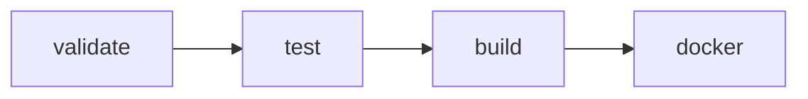
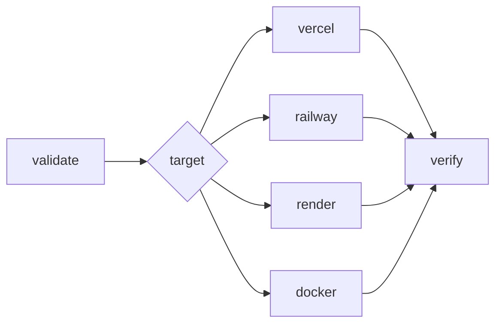
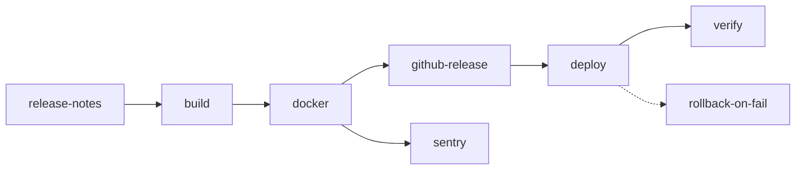

# CI/CD Pipeline

## Overview

Four GitHub Actions workflows handle continuous integration, security scanning, deployment, and release management.

## Workflows

| Workflow | File | Trigger | Purpose |
|----------|------|---------|---------|
| **CI** | `ci.yml` | Push/PR to main/develop | Validate, test, build, Docker build |
| **Security** | `security.yml` | Weekly schedule + push to main | Dependency audit, CodeQL, Docker scan, secret scan |
| **Deploy** | `deploy.yml` | Push to main/release + manual | Deploy to Vercel, Railway, Render, or Docker |
| **Release** | `release.yml` | Tag v*.*.* + manual | GitHub Release, Docker push, Sentry release, production deploy |

---

## CI Pipeline (`ci.yml`)

Runs on every push and pull request to `main` and `develop`.

### Jobs



1. **Validate** — TypeScript check, linting, dependency audit
2. **Test** — Full test suite (Vitest)
3. **Build** — Production build (Next.js)
4. **Docker** — Build Docker image, scan with Trivy

### Required Secrets

| Secret | Used By |
|--------|---------|
| `NEXT_PUBLIC_CLERK_PUBLISHABLE_KEY` | Build step for Clerk keys |
| `SENTRY_ORG` | Sentry source map upload |
| `SENTRY_PROJECT` | Sentry source map upload |

### Caching

- npm dependencies: Built-in `actions/setup-node` cache
- Prisma client: Custom cache keyed by `prisma/schema.prisma` hash
- Docker layers: GitHub Actions cache (`type=gha`)

---

## Security Pipeline (`security.yml`)

Runs weekly (Monday 06:00 UTC) and on every push to main.

### Jobs

| Job | Tool | Scope |
|-----|------|-------|
| **Audit** | npm audit + dependency-review-action | Dependency vulnerabilities |
| **CodeQL** | GitHub CodeQL | Code analysis (JavaScript/TypeScript) |
| **Docker Scan** | Trivy | Container image vulnerabilities |
| **Secrets** | Gitleaks | Hardcoded secrets in repository |

### Reporting

- CodeQL results appear in GitHub Security tab
- Trivy results uploaded as SARIF artifacts
- Gitleaks findings reported as PR annotations

---

## Deploy Pipeline (`deploy.yml`)

Triggered by pushes to `main`, `release/*`, or manual workflow dispatch.

### Jobs



### Deployment Targets

#### Vercel

- **Auto-deploy**: Push to `main` deploys to production
- **Manual**: Workflow dispatch with `target: vercel`
- **Rollback**: `npx vercel rollback` or Vercel dashboard
- **Secrets**: Set in Vercel dashboard or via CLI

#### Railway

- **Manual**: Workflow dispatch with `target: railway`
- **Auth**: `RAILWAY_TOKEN` secret + `RAILWAY_SERVICE` variable
- **Rollback**: Railway dashboard → Deployments → Promote

#### Render

- **Auto-deploy**: Push to `main` (if configured in Render dashboard)
- **Manual**: Workflow dispatch with `target: render`
- **Auth**: `RENDER_API_KEY` + `RENDER_SERVICE_ID`
- **Rollback**: Render dashboard → Deploy History → Rollback

#### Docker

- **Auto-deploy**: Tag push `v*.*.*`
- **Manual**: Workflow dispatch with `target: docker`
- **Registry**: GitHub Container Registry (`ghcr.io`)
- **Tags**: `latest`, semver (`v1.2.3`), short SHA
- **Rollback**: Redeploy previous tag

### Required Secrets

| Secret | Used By |
|--------|---------|
| `VERCEL_TOKEN` | Vercel deployment |
| `VERCEL_ORG_ID` | Vercel deployment |
| `VERCEL_PROJECT_ID` | Vercel deployment |
| `RAILWAY_TOKEN` | Railway deployment |
| `RENDER_API_KEY` | Render deployment |
| `RENDER_SERVICE_ID` | Render deployment |
| `SLACK_WEBHOOK_URL` | Failure notifications (optional) |

---

## Release Pipeline (`release.yml`)

Triggered by pushing a version tag (`v*.*.*`) or manual workflow dispatch.

### Jobs



### Running a Release

```bash
# 1. Ensure main is up to date
git checkout main
git pull origin main

# 2. Run tests locally
npm test

# 3. Create and push tag
git tag -a v1.2.3 -m "Release v1.2.3"
git push origin v1.2.3

# 4. GitHub Actions handles the rest:
#    - Builds and tests
#    - Pushes Docker image to ghcr.io
#    - Creates GitHub Release with changelog
#    - Creates Sentry release
#    - Deploys to production
```

### Manual Release

```bash
# Trigger from GitHub UI:
# Actions → Release → Run workflow
# Enter version (e.g., v1.2.3)
# Set pre-release if applicable
```

### Rollback

If the deployment fails, the pipeline supports:

1. **Vercel**: `npx vercel rollback`
2. **Docker**: `docker compose -f docker-compose.prod.yml down && TAG=v1.2.2 docker compose up -d`
3. **Railway**: Dashboard → Deployments → Promote
4. **Render**: Dashboard → Deploy History → Rollback

---

## Local CI Simulation

```bash
# Run the same checks as CI
npm ci
npx prisma generate
npx tsc --noEmit
npm run lint
npm test
npm run build

# Docker build validation
docker build -t repurpose-ai:local .
docker scan repurpose-ai:local  # or use trivy
```

---

## Environment Variables Required by CI

| Variable | Where to Set | Required |
|----------|-------------|----------|
| `NEXT_PUBLIC_CLERK_PUBLISHABLE_KEY` | GitHub Secrets | For build |
| `NEXT_PUBLIC_APP_URL` | GitHub Variables | For build |
| `SENTRY_ORG` | GitHub Secrets | For Sentry |
| `SENTRY_PROJECT` | GitHub Secrets | For Sentry |
| `VERCEL_TOKEN` | GitHub Secrets | For Vercel deploy |
| `VERCEL_ORG_ID` | GitHub Secrets | For Vercel deploy |
| `VERCEL_PROJECT_ID` | GitHub Secrets | For Vercel deploy |
| `RAILWAY_TOKEN` | GitHub Secrets | For Railway deploy |
| `RENDER_API_KEY` | GitHub Secrets | For Render deploy |
| `RENDER_SERVICE_ID` | GitHub Secrets | For Render deploy |
| `SLACK_WEBHOOK_URL` | GitHub Secrets | For notifications (optional) |

---

## Monitoring Deployments

After deployment, verify:

```bash
# Health check
curl https://your-domain.com/api/health

# Response should be:
# {"status":"ok","timestamp":"...","version":"1.0.0","name":"RepurposeAI","checks":{...}}
```
